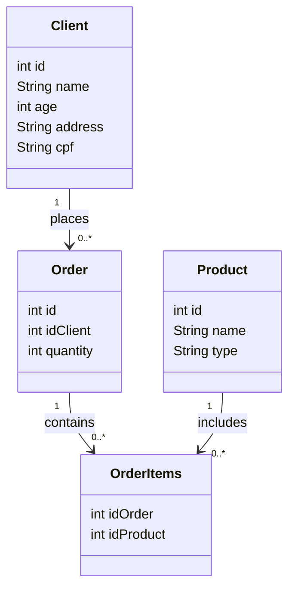

```mermaid
classDiagram
class Client {
int id
String name
int age
String address
String cpf
}

    class Order {
        int id
        int idClient
        int quantity
    }

    class Product {
        int id
        String name
        String type
    }

    class OrderItems {
        int idOrder
        int idProduct
    }

    Client "1" --> "0..*" Order : places
    Order "1" --> "0..*" OrderItems : contains
    Product "1" --> "0..*" OrderItems : includes
```